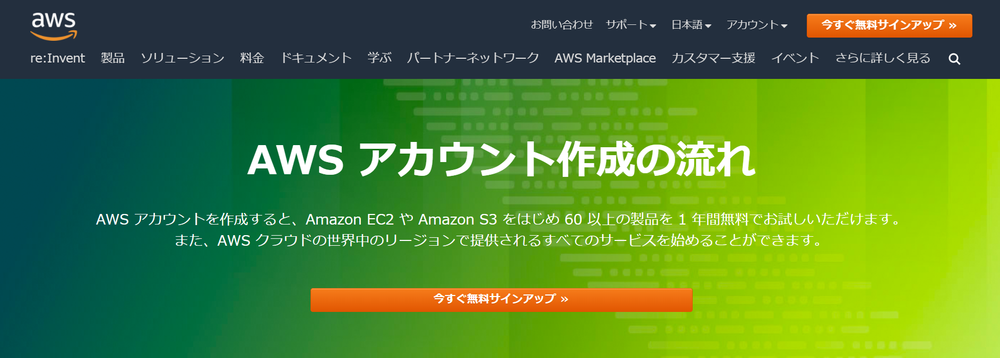
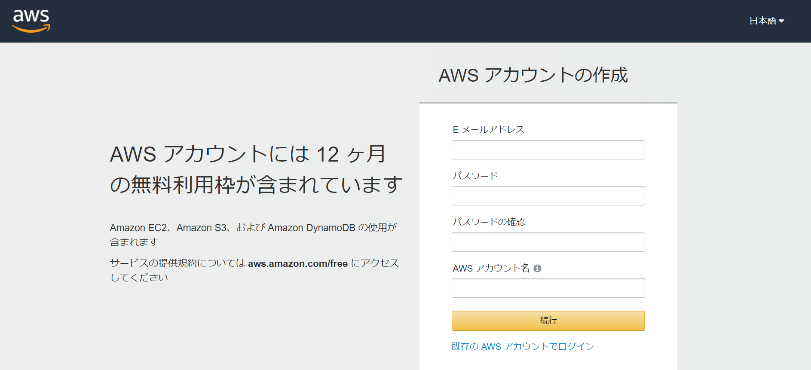
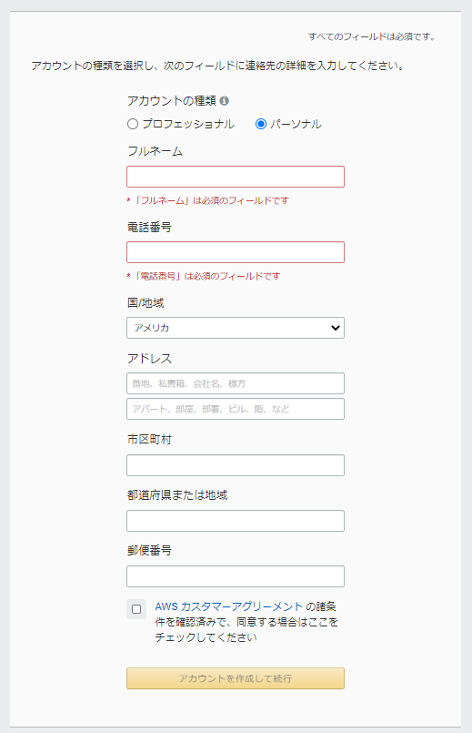
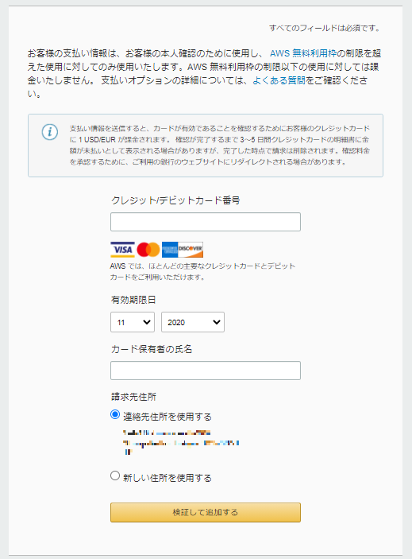
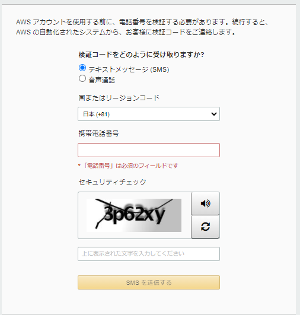
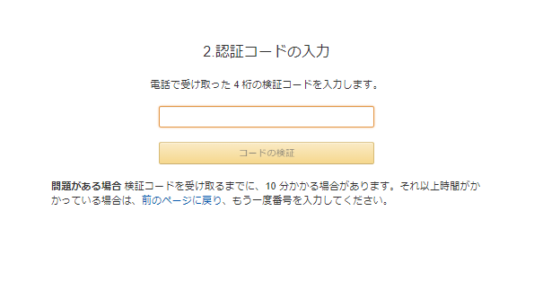
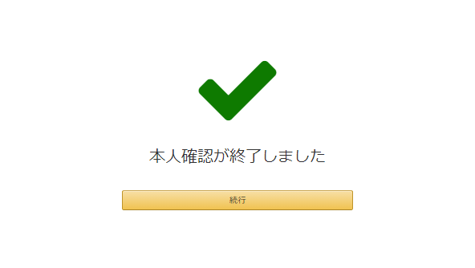
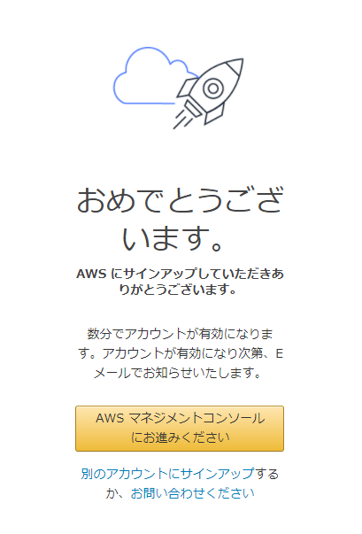

## Cloud9とは

Cloud9はAWS(Amazon Web Service)が提供している**統合開発環境**、または**IDE**です。

他のIDEだと、Microsoftが提供しているVisual Studioや、IBMが提供しているEclipseなどが有名です。

Cloud9の大きな特徴としては、ブラウザ上で操作するので、MacやWindows等の環境に依存せずに開発を進めることができます。

また、Node.js、JavaScript、Python、PHP、Ruby、Go、C++ などのツールがあらかじめパッケージ化されているため、基本的な設定を行わずに開発を進めることができます。

Cloud9は完全従量課金での利用になりますが、1年間は無料で利用することができます。

利用料金の詳細については「**注意事項**」に記載しておりますので、そちらを参考にしてください。

### Cloud9を利用するにあたっての必要条件
- メールアドレスを持っていること
- クレジットカードまたはデビットカードを持っていること

## Cloud9の環境構築

### AWSアカウントの作成

ここからはAWSアカウントの作成を進めていきます。

既に作成をしたことがある方は、**Cloud9のセットアップ**まで読み飛ばしてください。

以下のURLにアクセスしてください。

[AWSアカウント作成](https://aws.amazon.com/jp/register-flow/)

以下のような画面が表示されるので、「**今すぐ無料サインアップ**」をクリックしてください。

以下の画面で、下記の情報を入力しましょう。
- Eメールアドレス
- パスワード
- パスワードの確認
- AWS アカウント名
※アカウント名は後で変更可能です。

続いて、連絡先情報を入力する画面が表示されるので、必要な情報を全て入力しましょう。

※**アカウントの種類**は「**パーソナル**」選択してください。

※英語での入力になります。

入力が完了したら、

「AWS カスタマーアグリーメント の諸条件を確認済みで、同意する場合はここをチェックしてください」

にチェックを入れて、「**アカウントを作成して続行**」をクリックしましょう。

すると、以下のような支払情報を入力する画面が表示されると思います。

AWSのサービスは利用したサービス料に応じて課金されていく重課金性になります。画面上にも表示されているとは思いますが、`登録後1年間は無料`で使うことができますが、無料期間が終わると課金されていく仕組みです。

利用料金等の確認方法は「**注意事項**」のパートに記載されていますので、そちらを参照してください。

- カード番号
- 有効期限
- 氏名
- 請求先住所

を入力して、「検証して追加する」をクリックしましょう。

すると以下のような本人確認画面が表示されます。

「**検証コードをどのように受け取りますか?**」
の部分は、「テキストメッセージ(SMS)」と「音声通話」のどちらを選択しても構いませんが、特に事情がない場合は「テキストメッセージ(SMS)」で問題ないかと思います。

必要な情報を入力して、「**SMSを送信する**」をクリックしましょう。

すると、4桁の認証コードが届くかと思いますので、認証コードを入力して「**コードの検証**」をクリックましょう。

以下のような画面が表示されれば、本人確認は完了です。「**続行**」をクリックして次に進みます。

以下のような画面が表示されます。

この教材では最低限の機能しか使わないため、「**ベーシックプラン**」を選択して次に進みます。

以下のような画面が表示されれば、正常にAWSアカウントが作成されています。

数分以内にAWSからメールが届くので、届き次第「AWS マネジメントコンソールにお進みください」をクリックしてCloud9のセットアップに進みましょう。

### Cloud9のセットアップ

それでは、実際にCloud9を起動してみましょう。

### VPCの設定

Cloud9はVPCを利用しています。

