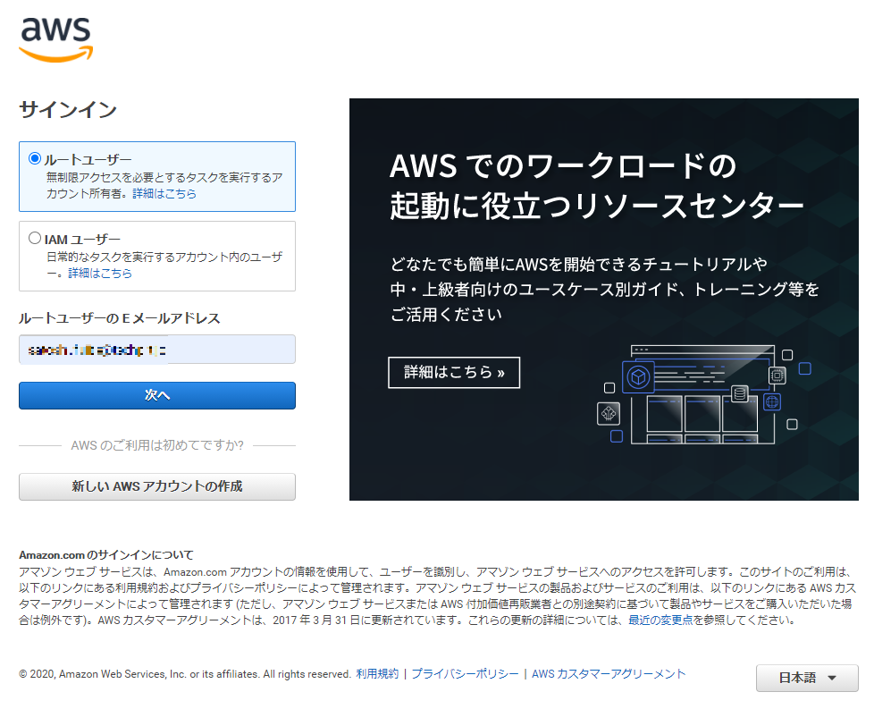
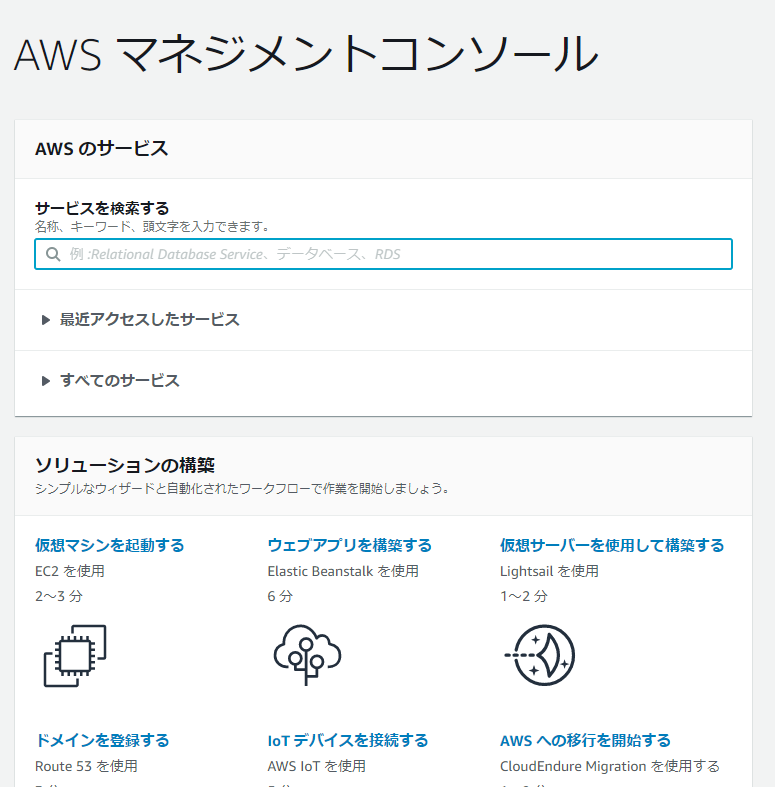
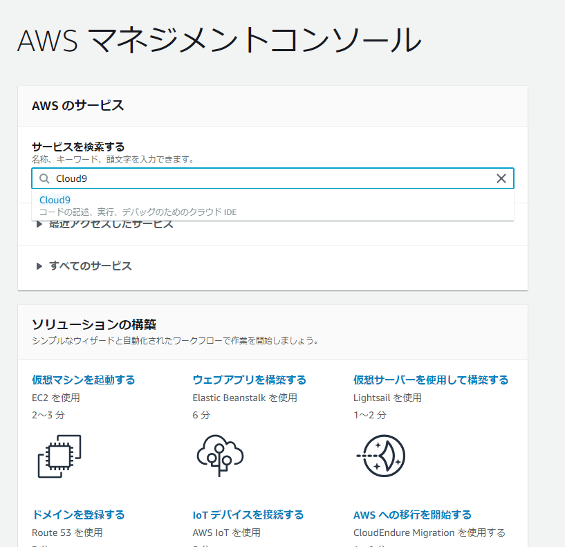
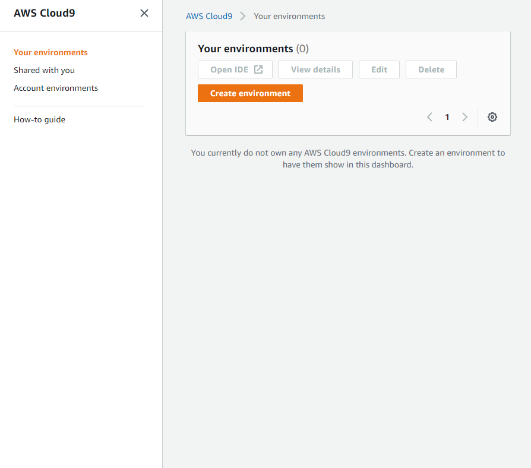
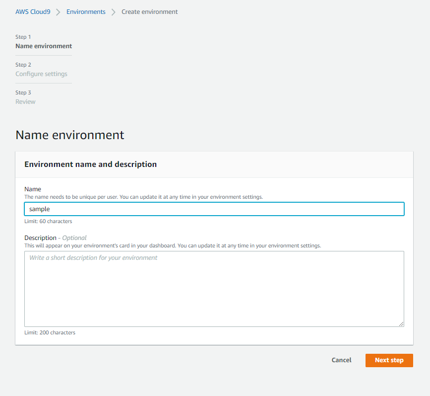
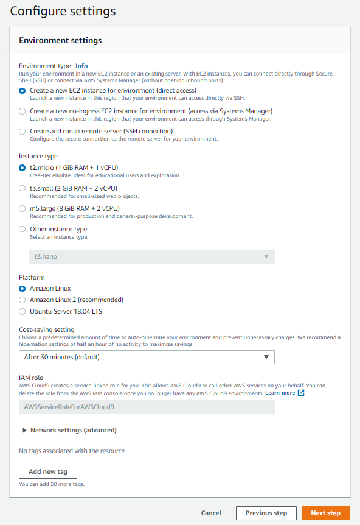
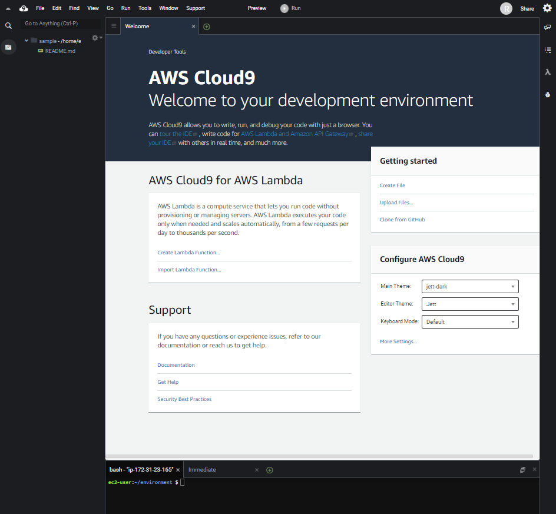

# Cloud9の環境構築

## Cloud9とは

Cloud9はAWS(Amazon Web Service)が提供している**統合開発環境**、または**IDE**です。

他のIDEだと、Microsoftが提供しているVisual Studioや、IBMが提供しているEclipseなどが有名です。

Cloud9の大きな特徴としては、ブラウザ上で操作するので、MacやWindows等の環境に依存せずに開発を進めることができます。

また、Node.js、JavaScript、Python、PHP、Ruby、Go、C++ などのツールがあらかじめパッケージ化されているため、基本的な設定を行わずに開発を進めることができます。

※詳細な言語サポートに関しては[AWS公式サイト](https://docs.aws.amazon.com/ja_jp/cloud9/latest/user-guide/language-support.html)をご覧ください。

Cloud9は完全従量課金での利用になりますが、1年間は無料で利用することができます。

利用料金の詳細については「**注意事項**」に記載しておりますので、そちらを参考にしてください。

## Cloud9を利用するにあたっての必要条件
- メールアドレスを持っていること
- クレジットカードまたはデビットカードを持っていること

## Cloud9のセットアップ

それでは、実際にCloud9を起動してみましょう。

以下の画面から「**ルートユーザー**」としてサインインします。

パスワードには先ほど登録したパスワードを入力しましょう。

するとコンソールが開きます。

「**サービスを検索する**」の欄に「**Cloud9**」と入力して、クリックしてください。

以下のような画面が表示されます。

「**Create enviroment**」をクリックしましょう。

以下のような画面が表示されるので、「**Name**」の部分に任意の名前を入力しましょう。ここでつけた名前が環境の名前になります。

ここでは`sample`としています。

名前の入力が終わったら、「**Next step**」をクリックします。

すると、以下のような画面が表示されます。

「**Network settings (advanced)**」の部分をクリックしてください。

上記の画像のように、「**Network (VPC)** 」にデフォルトの値が設定されていることを確認してください。

※Network (VPC)に値が表示されない場合は別途VPCの設定を行う必要があります。この先のパートの「注意事項」の「VPCの設定」を参考にして設定を行ってください。

今回は特に設定は変更せずデフォルトの設定のまま進めましょう。

設定の詳細は公式サイトを参考にしてください。

[AWS Cloud9公式]https://docs.aws.amazon.com/ja_jp/cloud9/latest/user-guide/tutorial-create-environment.html

「**Next step**」をクリックして次の画面に進みます。

以下のような画面が表示されるので、内容を確認の上、「**Create enviroment**」をクリックします。

以下のように表示されれば、Cloud9のセットアップは完了です！

Cloud9の環境構築は以上になります。
