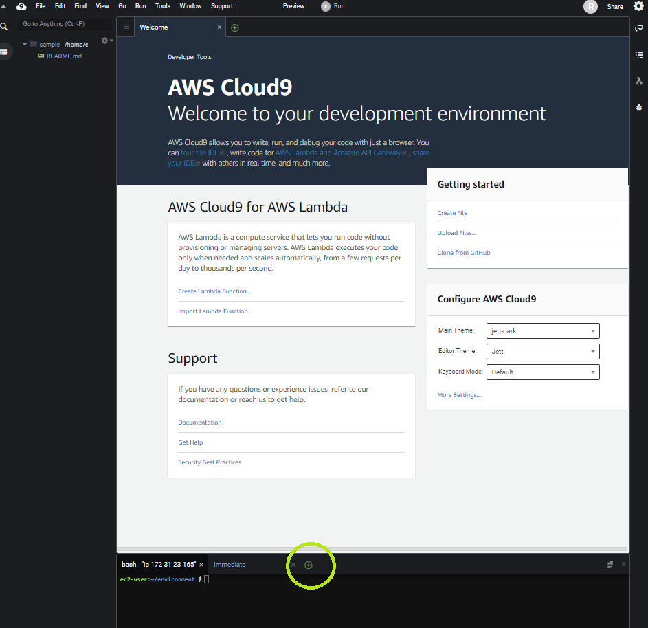
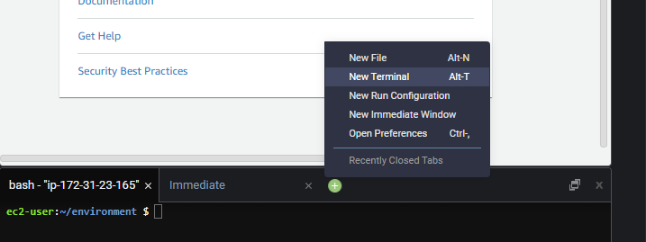
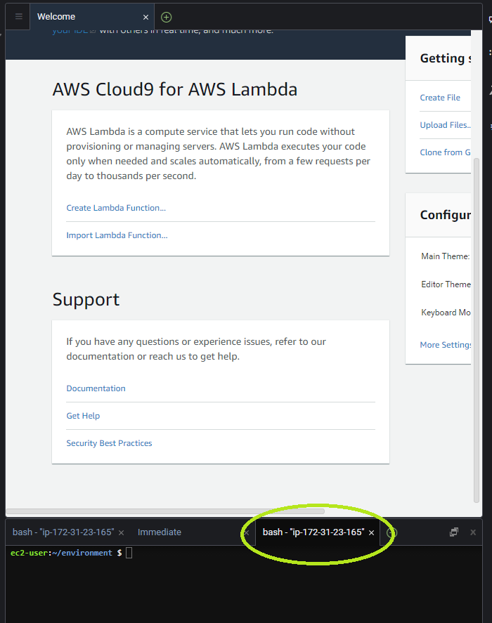
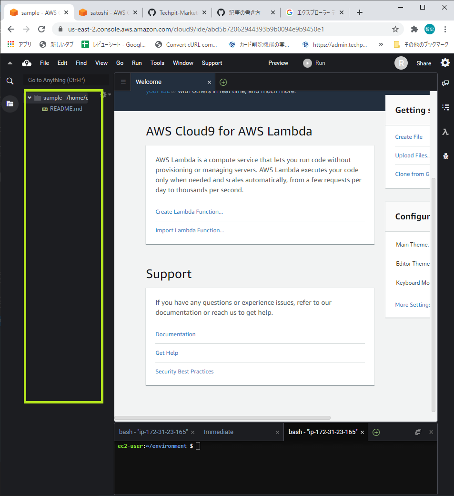
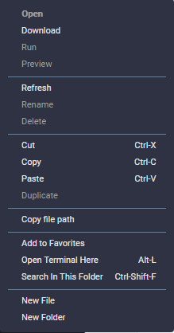
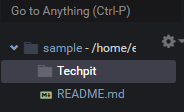
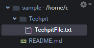
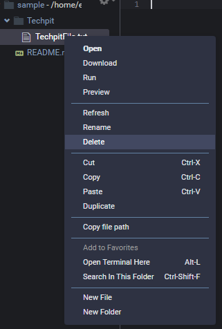
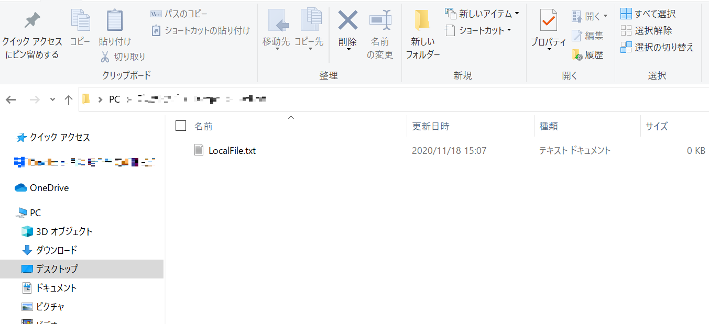
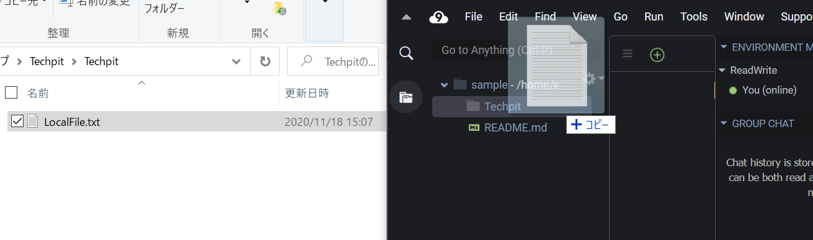

## Cloud9の基本操作

ここでは、簡単なCloud9の使い方とGitHubとの連携方法について説明していきます。

普段使っているMacやWindowsの操作と大きく異なる部分はないので、必要のない方は次のパートに進んでください。

### 基本操作

まずは**Terminal**を立ち上げましょう。

**Terminal**はWindowsでいうところの**コマンドプロンプト**になります。

以下の「+」ボタンをクリックしてください。

以下のような画面が表示されるので、「**New Terminal**」をクリックしてください。

すると、以下のように新しくターミナルが追加されているのがわかるかと思います。

**続いてファイルの作成を行います。**

以下の画像で囲まれている部分を右クリックします。

以下のような画面が表示されるので、「**New Folder**」をクリックしてフォルダの名前を入力しましょう。

ここでは「Techpit」と入力しています。

以下のように「Techpit」というフォルダーが作られているのがわかるかと思います。

次に「Techpit」フォルダーの中に、新しいファイルを作成しましょう。

「Techpit」フォルダーを右クリックして、「**New File**」をクリックします。

名前の入力を求められるので、任意の名前を入力してください。

ここでは、「TechpitFile.txt」としています。

以下のように「TechpitFile.txt」ファイルが作成されているのがわかるかと思います。

「TechpitFile.txt」をダブルクリックするとエディタが起動します。実際にコードを書くときはここに記載しましょう。

※ファイルを作成するときに、「Folder/File」とすると、指定のFolderにファイルが作成されます。指定したフォルダーが存在しない場合は、フォルダーも併せて作成されます。

ファイルorフォルダーを削除するときは、ファイルを右クリックして、「**delete**」をクリックします。

確認を求められたら「Yes」をクリックしましょう。

以下の画像のように「TechpitFile.txt」がなくなっていればファイルが削除されています。

### ファイルのインポート

Cloud9では、ローカルのファイルをインポートすることができます。

ここではローカルで作成したテキストファイルをCloud9上にアップロードしてみましょう。

Desktopに「LocalFile.txt」を任意の場所に作成します。

このファイルをCloud9上の「Techpit」フォルダにコピーしてみましょう。

以下のようにドラック＆ドロップします。

以下のようにCloud9上のフォルダにローカルのファイルがコピーされているのがわかるかと思います。

教材内でファイルをインストールする場合があるときは上記のような手順でCloud9上のプロジェクトに反映させましょう。

以上でCloud9の基本操作は終わりです。

