# 注意事項

このパートはCloud9を初めて使う方際に注意しなくてはいけないことを記載しているパートになります。教材を進めるにあたっては設定の必要はありませんが、利用料金に関する設定や、VPCの設定方法について記載しておりますので、適時確認するようにしましょう。

### 料金の確認&通知方法

AWSは1年間の無料期間終了後は使用分に応じて料金が課金されていきます。

1年間はAWSアカウントを作成した日からカウントされます。正確な請求開始日を確認する場合はサポートに問い合わせる必要がありますが、大体の日数であれば確認することができます、

このパートではAWSから余計な料金を請求されないように料金の確認方法等を確認していきます。

以下のURLからコンソールにログインしましょう。

https://us-east-2.console.aws.amazon.com/console/

「サービスを検索する」の欄に「Billing」と入力して、クリックしてください。

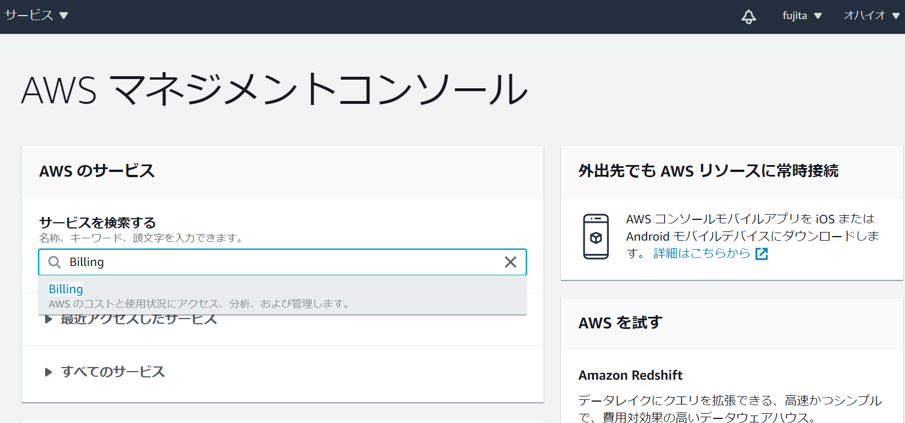

すると以下のように請求額が表示されます。

ここで毎月の請求額が確認できます。

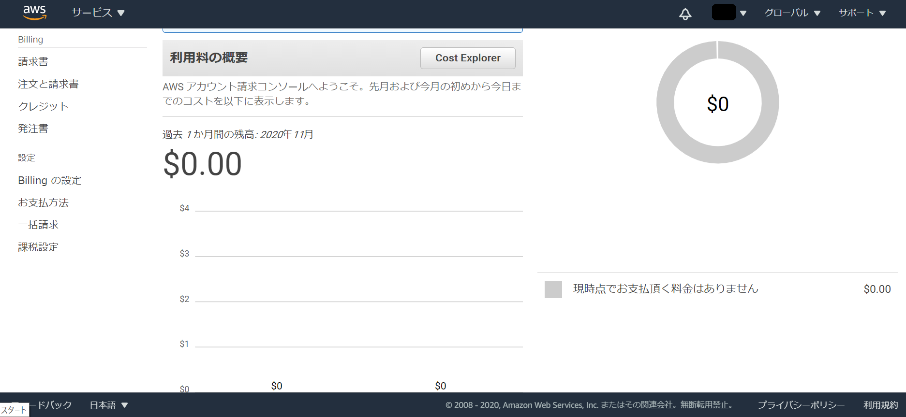

次に無料期間の開始日を確認していきます。

画面左側に表示されている「請求書」をクリックしてください。

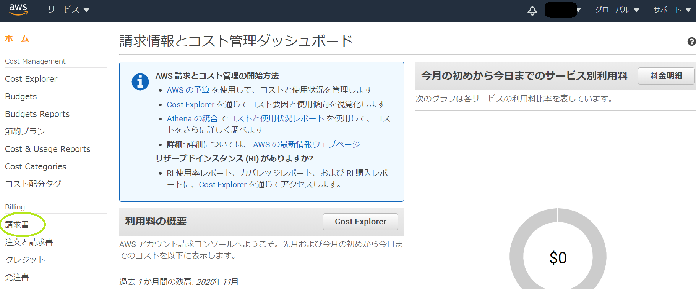

「日付」の右側の「▼」をクリックします。

すると、以下のように各月の請求額が選択できるような画面が表示されます。

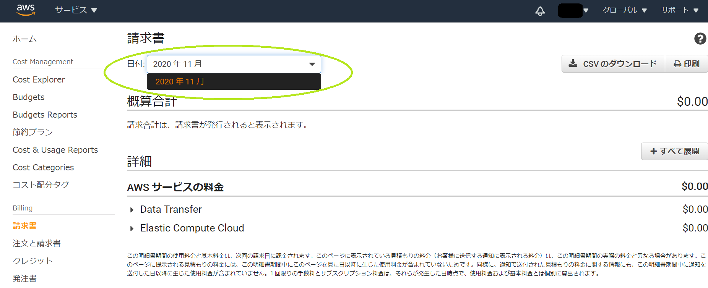

上記の画像だと、2020年11月にAWSアカウントを作成したことになります。

そのため、少なくとも2021年10月までは無料枠を使えます。

期間終了後に請求が発生しないように各自のリマインダーやカレンダー等で無料期間の終了日をメモしておくようにしましょう。

次に、無料枠を超過し、請求が発生した場合にアラートが飛ぶように設定します。

左側に表示されている「**Billing の設定**」をクリックしてください。

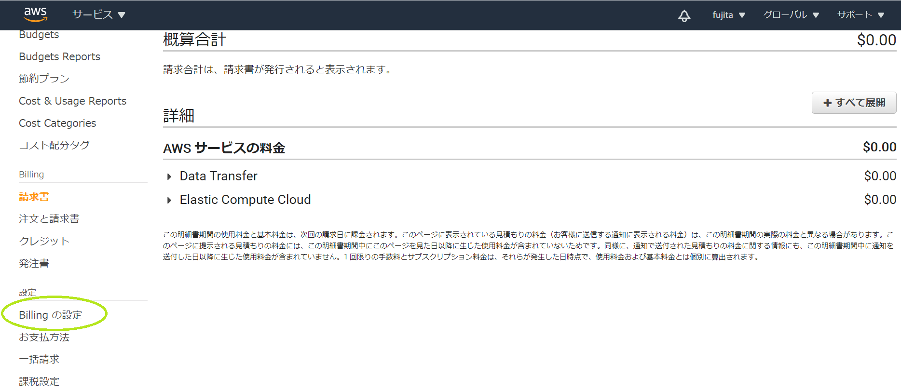

以下のような画面が表示されます。

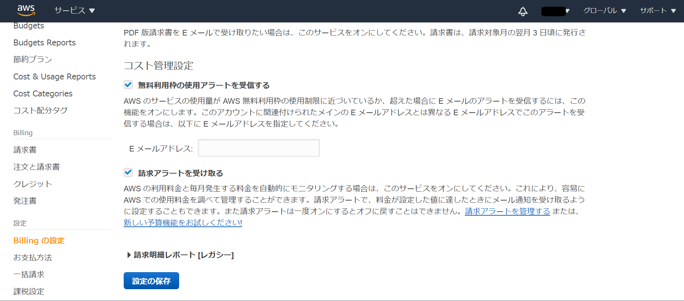

- 無料利用枠の使用アラートを受信する
- 請求アラートを受け取る
上記の項目にチェックをいれて、「設定の保存」をクリックしましょう。

以上で料金に関する設定は終わりです。

### 二段階認証の設定方法

上述の通り、AWSアカウントは使用分に応じて料金が課金されていきます。

万が一アカウント情報が漏洩した場合、思わぬ請求が発生する可能性があります。

第三者によるアカウントの不正利用を防ぐために**二段階認証**の設定を強く推奨します。

以下では二段階認証の設定方法を解説していきます。

1. MFAアプリアプリのインストール(iPhone/Android)

二段階認証の設定にはモバイルアプリをインストールする必要があります。

以下のURL又は、ストアで「Authy」と検索してアプリをインストールしてください。

iPhone: https://itunes.apple.com/us/app/authy/id494168017

Android: https://play.google.com/store/apps/details?id=com.authy.authy

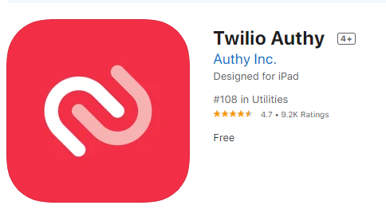

以下のURLからコンソールにログインしましょう。

https://us-east-2.console.aws.amazon.com/console/

右上にあるアカウント名をクリックして、「**マイセキュリティ資格情報**」をクリックしてください。

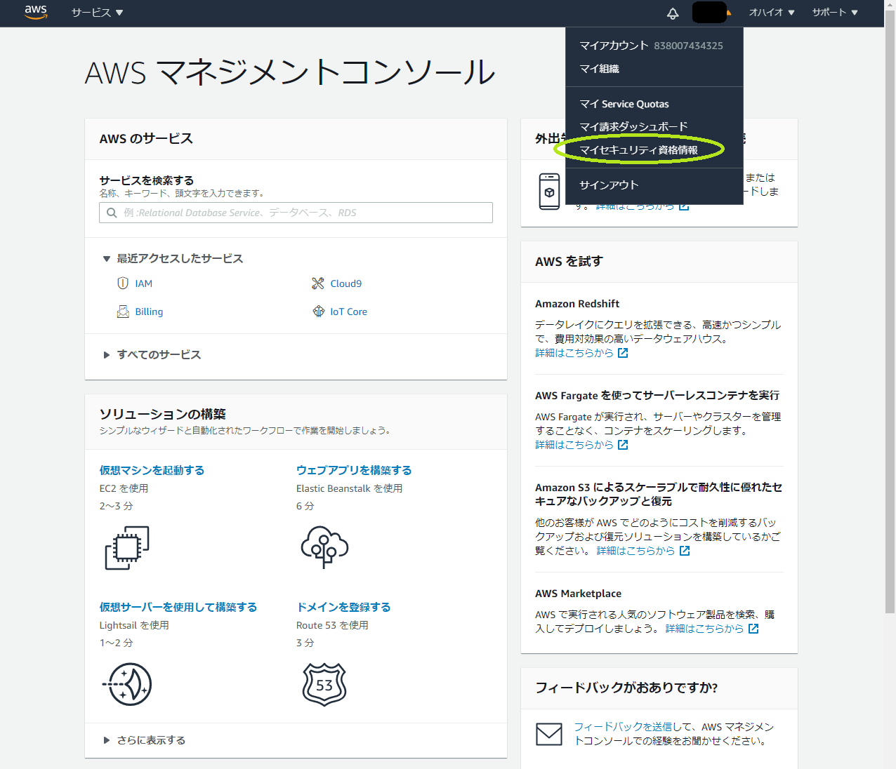

「**多要素認証(MFA)** 」をクリックして、「**MFAの有効化**」をクリックして下します。

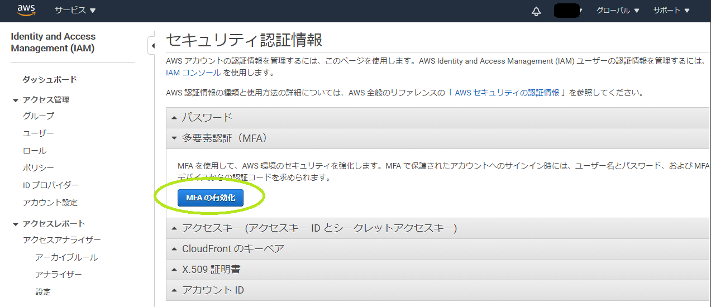

以下のような画面が表示されたら、「**仮想 MFA デバイス**」を選択して、「**続行**」をクリックしてください。

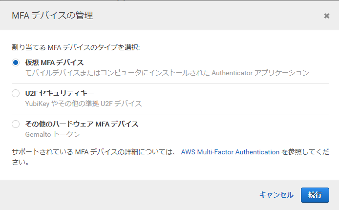

2.仮想 MFA アプリとデバイスのカメラを使用して QR コードをスキャンします の「**QRコードの表示**」をクリックしてください。

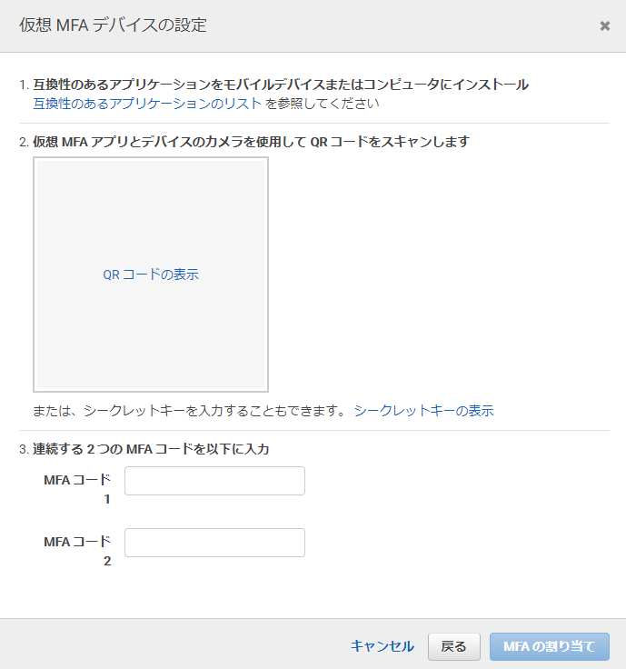

表示されたコードを先ほどインスト―ルしたモバイルアプリで読み取ります。

アプリ上で表示された6桁の数字を「**MFA コード 1**」に入力してください。

しばらくすると、アプリ上で別の6桁の数字が表示されるので、「**MFA コード 2**」に入力して「**MFAの割り当て**」をクリックします。

以下のような画面が表示されれば二段階認証の設定は完了です。

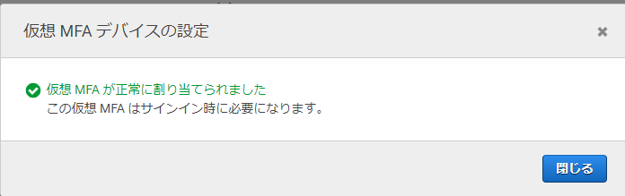

今後新しい端末やブラウザからAWSにアクセスする際は以下のようにMFA コードの入力を求められます。モバイルアプリに表示される番号を入力してログインしましょう。

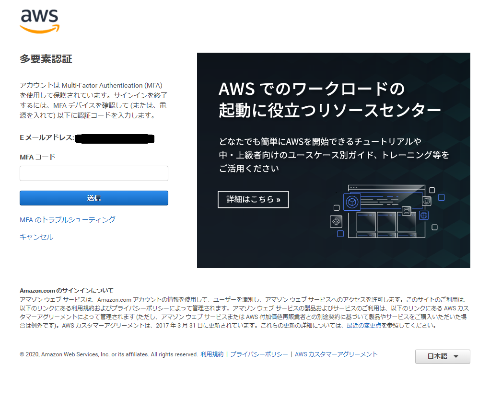

### VPCの設定

AWS Cloud9を使用するには**VPC**を設定する必要があります。

AWS公式サイトに記載されているVPCに関する説明は以下の通りです。

[Amazon Virtual Private Cloud](https://aws.amazon.com/jp/vpc/)

>Amazon Virtual Private Cloud (Amazon VPC) では、AWS クラウドの論理的に分離されたセクションをプロビジョニングし、お客様が定義した仮想ネットワーク内の AWS リソースを起動することができます。自分の IP アドレス範囲の選択、サブネットの作成、ルートテーブルやネットワークゲートウェイの設定など、仮想ネットワーキング環境を完全に制御できます。

簡単に言うと、AWSが持っている共有クラウドの中に、各ユーザーの空間を割り当てるような仕組みです。

ここでは詳細な説明は省き、Cloud9用のVPCの設定方法のみ説明していきます。

「Cloud9の環境構築」でデフォルトのVPCが設定されていた方は設定不要ですので読み飛ばしてください。

※VPCはアカウント作成時に自動で作成してくれます。
※このパートは何らかの事情でVPCを削除してしまった方向けです。

**1. VPCの作成**

以下のURLからコンソールにログインしましょう。

https://us-east-2.console.aws.amazon.com/console/

「**サービスを検索する**」の欄にVPCと入力してクリックしてください。

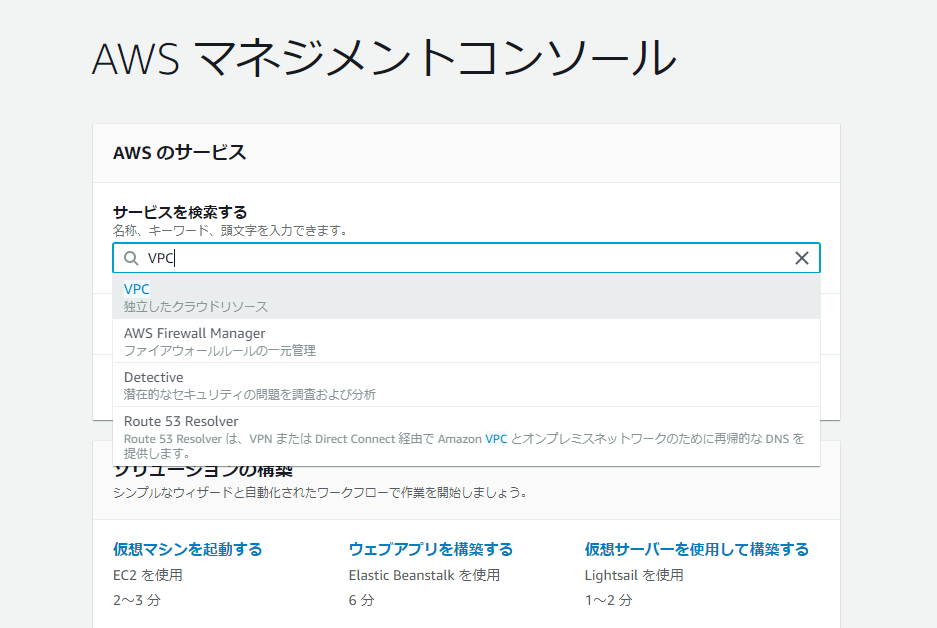

以下のような画面が表示されるので、「**VPCウィザードの起動**」をクリックしてください。

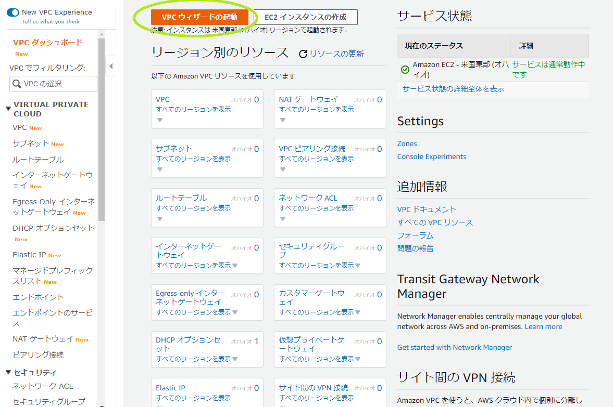

次に、「1 個のパブリックサブネットを持つ VPC」をクリックし、「**選択**」をクリックします。

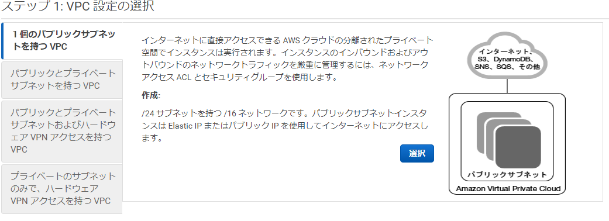

以下のような画面が表示されます。

特に設定は変更せずに「**VPCの作成**」をクリックしてください。

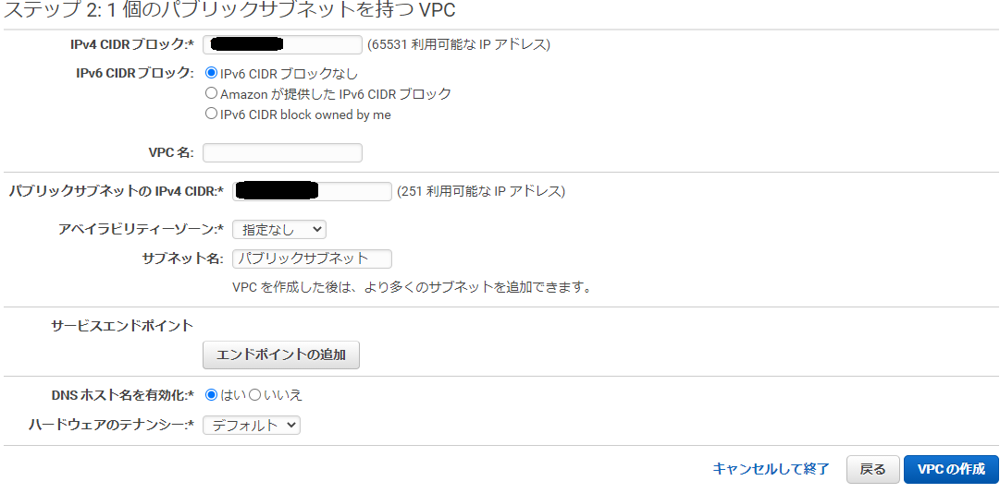

以下のような画面が表示されていれば、正常にVPCが作成されています。

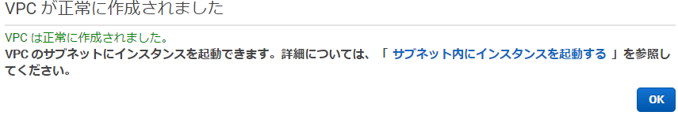

右下の「**ok**」ボタンをクリックしてください。

作成したVPCの左側にあるチェックボックスにチェックを入れ、「**CIDR**」を選択してください。

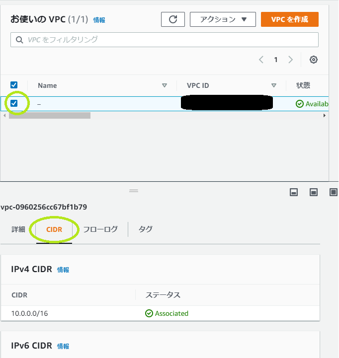

ここで表示されているCIDRの値をメモしておきましょう。

上記の画像では「10.0.0.0/16」となっています。

**2. サブネットの作成**

次にサブネットを作成していきます。

サブネットに関する詳細な説明はここでは省き、設定方法を説明していきます。

VPCのコンソール画面から、「**サブネット**」を選択してください。

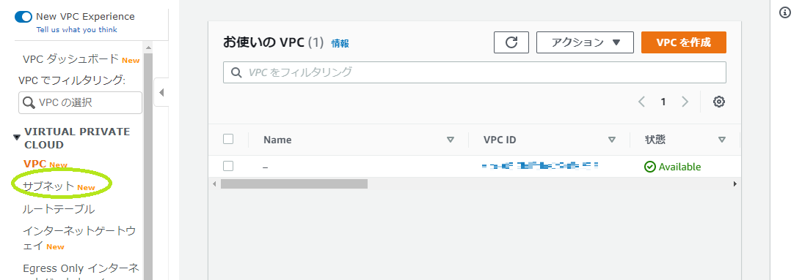

次に、「**サブネットを作成**」をクリックしてください。

※すでにVPCと連携しているサブネットが作成されている場合、サブネットの作成は不要です。

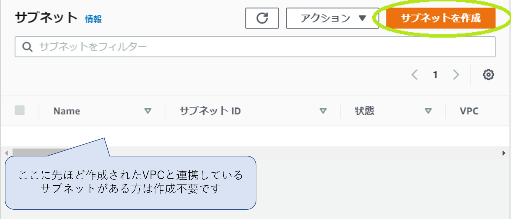

「**VPC ID**」の欄から、先ほど作成したVPCを選択します。

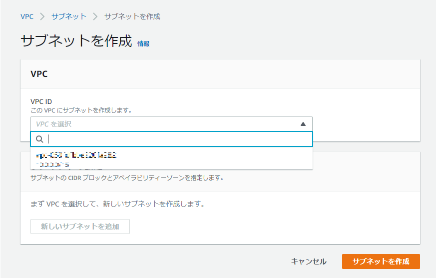

「IPv4 CIDR ブロック」に先ほどメモした値（ここでは「**10.0.0.0/16**」）、と入力し「サブネットを作成」をクリックします。

※サブネット名などの入力は任意です。

以上でサブネットの作成は終わりです。VPCと連携しているサブネットが作成していることが確認出来たら、「Cloud9の環境構築」に戻って環境構築を進めましょう！

