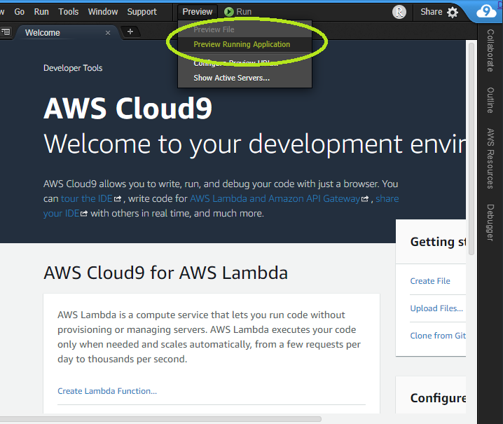
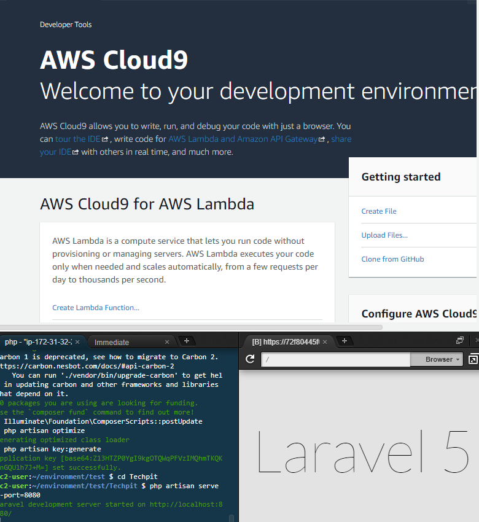

# 【Cloud9】バージョンの確認

この章では、PHPおよびLaravelのバージョンを確認していきます。

なお、この教材ではPHPのバージョンは○○、Laravelのバージョンは○○を推奨しています。

>↑↑↑↑↑↑↑↑↑↑↑↑↑↑↑↑↑↑↑↑↑↑↑↑↑↑↑↑↑↑↑↑↑↑↑↑↑↑↑↑↑↑↑↑↑↑↑↑↑↑↑↑↑↑↑↑↑↑↑↑↑↑↑↑↑↑↑↑↑↑↑↑↑↑↑↑
>○○に教材のバージョンを入れる


## PHPのバージョンを確認する

以下のURLからコンソールにサインインして、Cloud9を立ち上げましょう。

https://us-east-2.console.aws.amazon.com/console/

Cloud9上のTerminalを立ち上げて、以下のコマンドを実行してPHPのバージョンを確認しましょう。

```bash
$ php -v
```

以下のように数字が表示されます。
ここではPHPのバージョンが「**5.6.40**」であることがわかります。

Cloud9のPHPのバージョンが本教材のバージョンと同じであれば、「**Laravelのバージョンを確認する**」まで読み飛ばしてください。

```bash
$ php -v
PHP 5.6.40 (cli) (built: Oct 31 2019 20:35:16) 
Copyright (c) 1997-2016 The PHP Group
Zend Engine v2.6.0, Copyright (c) 1998-2016 Zend Technologies
    with Xdebug v2.5.5, Copyright (c) 2002-2017, by Derick Rethans
```

## PHPのバージョンを変更する

それではここからPHPのバージョンを変更していきます。

Linuxのパッケージ管理ツールである`yum`を使います。

以下のコマンドでパッケージをアップデートします。

```bash
$ sudo yum -y update
```

```bash
$ sudo yum -y update

//====略====
Updated:
  containerd.x86_64 0:1.4.1-1.5.amzn1                     docker.x86_64 0:19.03.13ce-1.62.amzn1    
  runc.x86_64 0:1.0.0-0.1.20200826.gitff819c7.2.amzn1    

Complete!
```

以下のコマンドでデフォルトでインストールされていたバージョンをアンインストールします。

バージョン5.6が入っていたので、`php56`としていますが、「**PHPのバージョンを確認する**」で表示されたバージョンを指定しましょう。

```bash
$ sudo yum remove php56*
```

途中、`Is this ok [y/N]`と表示されるので、「y」を入力して「Enter」をクリックします。


以下のように表示されていれば正常にアンインストールされています。

```bash
$ sudo yum remove php56*

//====略====
Dependency Removed:
  php-pear.noarch 1:1.10.1-1.19.amzn1                                                              

Complete!
```

次にインストールしたいPHPのバージョンをインストールしていきます。

ここでは、「PHP7.1」をインストールしているので、`php73`としています。各自必要なバージョンを指定するようにしてください。

```bash
$ sudo yum install php71*
```

途中、`Is this ok Is this ok [y/d/N]`と表示されるので、「y」を入力して「Enter」をクリックします。

以下のように表示されていれば正常にインストールが完了しています。

```bash
$ ysudo yum install php71*

//====略====
  pixman.x86_64 0:0.32.4-4.11.amzn1                                                                
  postgresql8-libs.x86_64 0:8.4.20-5.52.amzn1                                                      
  recode.x86_64 0:3.6-28.1.2.amzn1                                                                 
  tokyocabinet.x86_64 0:1.4.33-6.4.amzn1                                                           
  unixODBC.x86_64 0:2.2.14-14.7.amzn1                                                              
  urw-fonts.noarch 0:2.4-10.7.amzn1                                                                

Complete!
```

最後に、`/usr/bin/php`から元のバージョンへのリンクが張られているため、インストールしたバージョンにリンクを張り替えます。

```bash
$ sudo unlink /usr/bin/php
$ sudo ln -s /etc/alternatives/php7 /usr/bin/php
```

最後に以下のコマンドで、先ほど指定したバージョンが表示されることを確認してください。

```bash
$ php -v
PHP 7.1.33 (cli) (built: Oct 31 2019 17:36:04) ( NTS )
Copyright (c) 1997-2018 The PHP Group
Zend Engine v3.1.0, Copyright (c) 1998-2018 Zend Technologies
    with Zend OPcache v7.1.33, Copyright (c) 1999-2018, by Zend Technologies
    with Xdebug v2.5.5, Copyright (c) 2002-2017, by Derick Rethans
```

以上でPHPのバージョン変更は終了です。

## Laravelをインストールする

ここからはLaravelのインストールを行っていきます。

Laravelのインストールには**composer**というPHPのパッケージ管理システムを使っていきます。

まずは以下のコマンドでcomporserをインストールしましょう。

```bash
$ curl -sS https://getcomposer.org/installer | php
```

次にインストールしたcomporserを移動します。

```bash
$ sudo mv composer.phar /usr/local/bin/composer
```

composerがインストールされているか確認しましょう。以下のコマンドを実行して下さい。

```bash
$ composer
```

以下のように表示されていれば正常にインストールされています。

```bash
$ composer
   ______
  / ____/___  ____ ___  ____  ____  ________  _____
 / /   / __ \/ __ `__ \/ __ \/ __ \/ ___/ _ \/ ___/
/ /___/ /_/ / / / / / / /_/ / /_/ (__  )  __/ /
\____/\____/_/ /_/ /_/ .___/\____/____/\___/_/
                    /_/
Composer version 2.0.7 2020-11-13 17:31:06

//====略=====
  validate             Validates a composer.json and composer.lock.
  why                  Shows which packages cause the given package to be installed.
  why-not              Shows which packages prevent the given package from being installed.

```

それでは試しにLaravelのプロジェクトを作成してみましょう。

今回はLaravel 5.2で「Techpit」というサンプルプロジェクトを作成してみます。以下のコマンドを実行して下さい。

```bash
$ composer create-project "laravel/laravel=5.2.*" Techpit
```

最後に以下のコマンドを実行してサーバーを立ち上げてみましょう。

```bash
$ cd Techpit
$ php artisan serve --port=8080
```

プレビューを見るには、画面上部にある「**Preview**」ボタンをクリックし、「**Preview Running Application**」を選択します。



画面右下にスタート画面が表示されれば、Laravelプロジェクトは正しく作成されています。



以上でLaravelのインストールは終了です。

ここで作成したファイル/フォルダは削除して構いません。

※環境は削除しないでください。

教材とバージョンが異なると、思わぬエラーが発生する場合があります。教材と同じバージョンで進めることを推奨しています。


